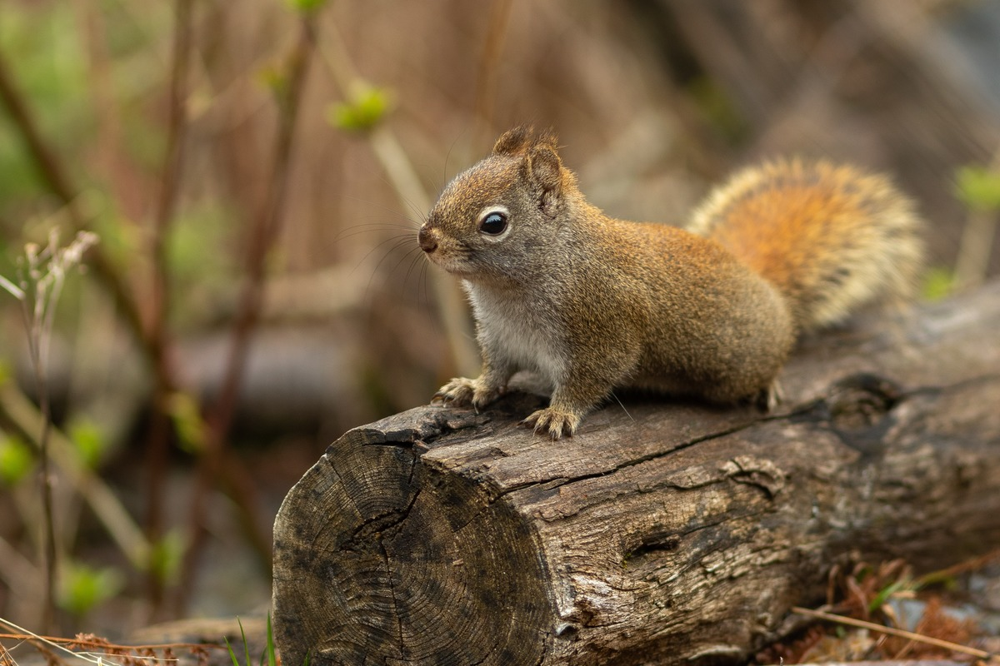

# Black & White : Terraform + ImageMagick + Lambda + invoke

Playing with **Terraform**, **Lambda** and **ImageMagick** to convert an color image from to black and white version.

### Exemple

### Thanks

Photo by [Sebastian Latorre](https://unsplash.com/@sebalatorre) on [Unsplash](https://unsplash.com/photos/xGiqiL483Oc)